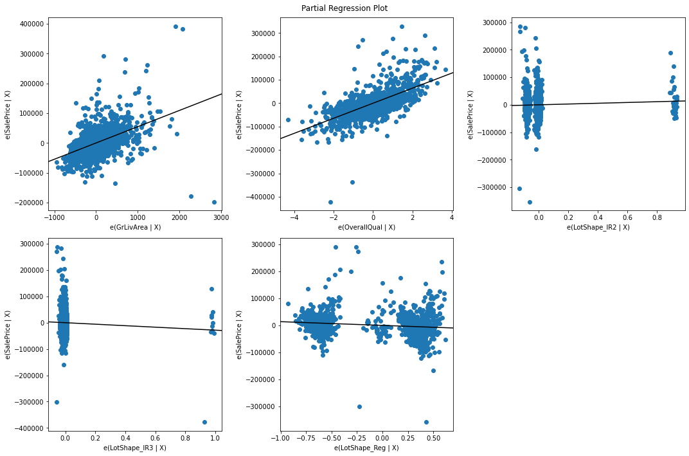

# Dealing with Categorical Variables in Regression

## Introduction

In this lab, you'll explore the Ames Housing dataset and identify numeric and categorical variables. Then you'll transform some categorical data and use it in a multiple regression model.

## Objectives

You will be able to:

* Determine whether variables are categorical or numeric
* Use one-hot encoding to create dummy variables

## Partial Regression Plots for Features

### The Error-based metric used was: sklearn's mean absolute error

MAE: 28396.05079899238

